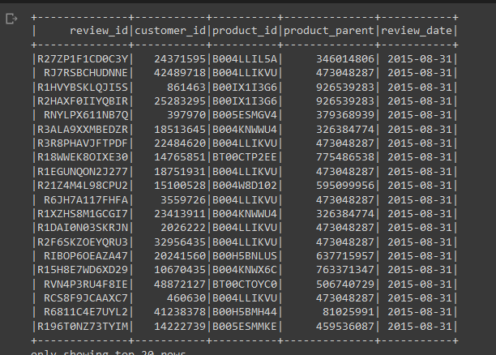
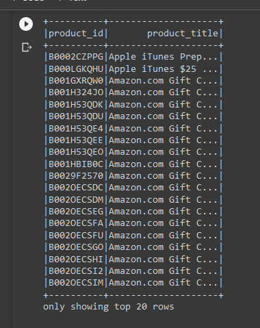
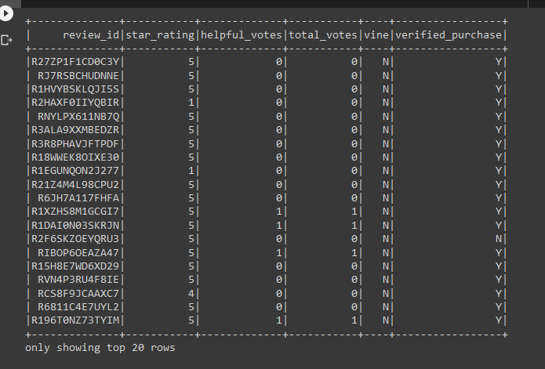
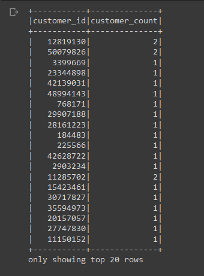
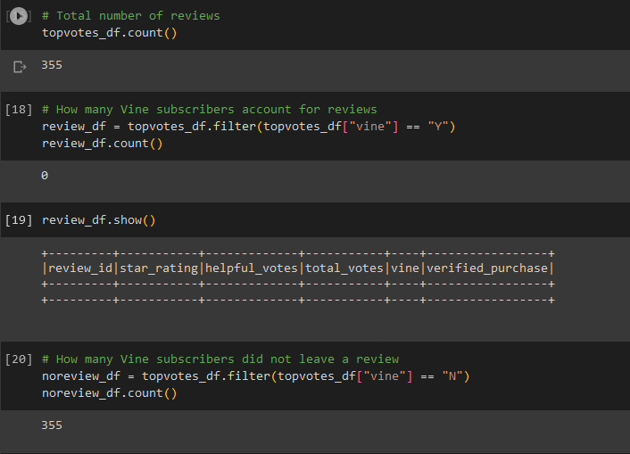
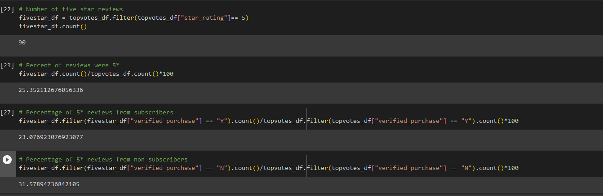

# Amazon_Vine_Analysis

In this project, you’ll have access to approximately 50 datasets. Each one contains reviews of a specific product, from clothing apparel to wireless products. You’ll need to pick one of these datasets and use PySpark to perform the ETL process to extract the dataset, transform the data, connect to an AWS RDS instance, and load the transformed data into pgAdmin. Next, you’ll use PySpark, Pandas, or SQL to determine if there is any bias toward favorable reviews from Vine members in your dataset. Then, you’ll write a summary of the analysis for Jennifer to submit to the SellBy stakeholders.

## Creating dataframes from large databases.

We were able to create dataframes using Google Collab and Spark from the large AWS datasets. VSCode would not have been able to handle the massive size, nor would the laptop I used to complete the assignment.

## Results

### Number of Vine reviews vs. Non-Vine reviews

One of our first points of analysis was the number of reviews that Vine users are writing reviews versus those users that are not part of the Vine program.

As you can see Vine subscribers make up 0% of the written reviews. They do leave reviews, but seemingly never write anything to justify those scores. Non-subscribers on the other hand seem more likely to leave a justified, helpful review.

### Five star reviews

Our next point of analysis was discovering how many five star, helpful, reviews were left. 

The total reviews that were five starts was 25.35%, while Vine subscribers only leave five star reviews 23.08% of the time, and non-subscribers leave five star reviews 31.58% of the time.

## Conclusions

This exercise was primarily performed as a way of introducing big data and using Google Collab, so the analysis was slightly scarce. However, we still can see some interesting trends in what we found

The fact that Vine subscribers are more likely to not leave any written justification for their ratings while simultaneously being less likely to leave a five star review means that they seemingly don't add much to the community as a whole. By not participating in the creation of justified reviews they leave little help for other users. But, by giving less five star reviews it might be possible that they are more carefully considering the rating they give when leaving a review.

Further analysis should be made into the full spread of ratings left by both subscribers and non-subscribers to see if the non-subscribers are more likely to rate on the extremes while subscribers space out their ratings accordingly. It is possible that subscribers also rate in the extremes, meaning they could be far more likely to give a one star review - and potentially leading to producers to attempt to avoid them as a market.
